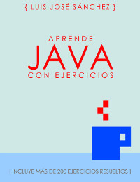

# Ejercicios de la Asignatura de Programacion, 1º DAM

Resolución de los Ejercicios de la Asignatura Programación, *1º DAM (Desarrollo de Aplicaciones Multiplataforma)* del **IES Campanillas**.

## Indice de Temas
 * Linux. Aprendizaje de comandos basicos de Linux. :penguin:
 * Git y Github. Aprendizaje uso de git y github. :octocat: 
 * Tema 1. ¡Hola Mundo! Salida por pantalla.
 * Tema 2. Variables.
 * Tema 3. Lectura de datos desde teclado.

## Bibliografía

[Aprende Java con Ejercicios](https://leanpub.com/aprendejava)

## Enlaces de Interés

* [Página Oficial del IES Campanillas](http://iescampanillas.com)
* [Guia de la Asisgnatura Programación](http://github.com/luisjosesanchez/programacion/)

